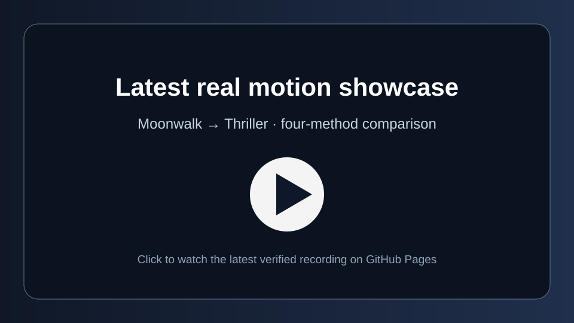

# Blender Asset Director

**Development source: `main` · runtime `0.6.0-dev.4`.** The published installer still installs **v0.5.0**; merging source does not publish a release or update an installed skill. Identify development builds by their full Git commit SHA.

## Latest real motion showcase

[](https://raal1600.github.io/blender-asset-director/)

**[▶ Watch on GitHub Pages](https://raal1600.github.io/blender-asset-director/)** — the latest verified four-second real-input comparison from private acceptance run `35032230325`, showing **Cut · NLA · Aligned · Director**. The published web copy is a compact derivative of the verified recording; the private original, source FBXs, `.blend` projects and reports remain private. This recording demonstrates one tested sequence and is not a claim of universal artistic quality.

[Contributor quick start](CONTRIBUTING.md) · [Current handoff and test gates](docs/CONSOLIDATION.md) · [Documentation index](docs/README.md) · [Technical Transition Lab](https://raal1600.github.io/blender-asset-director/#technical-validation)

Main brings together local animation intake, canonical motion and clay proxies, reviewed transfer planning, custom semantic roles, bone-display controls, subframe grounding, full-clip sequencing, physical-unit precision and imported action identity fixes. The sequence bridge adds an explicitly reviewed interval; it does not silently shorten either source clip. Technical tests and human performance review remain separate.

**Give Codex a small Blender production team, not another Blender harness.**

Use a prompt and an existing scene to reuse suitable assets, scout real gaps, plan shots, adapt sourced motion, improve camera/lighting and review evidence. One skill selectively loads seven responsibilities: director/producer, production design/scout, performance, cinematography, lighting/look development, editorial/finishing and continuity/QA. There are no scene-name, lens, FPS or character-specific production presets.

## Current published preview: v0.5.0

This release completes the evaluated-pose retargeting branch with explicit reference-frame conversion, optional bounded sole grounding and additive floor staging. It fixes glTF retarget import timebases and fractional NLA endpoints, adds separate `playback_speed`, and includes the new Blender component and end-to-end job tests in CI. Legacy retargeting stays the default.

**Technical transfer is not proof of natural performance.** These fixes do not turn an unsuitable source into convincing human footwork. Video-to-mocap and live streaming are **not implemented**. The researched next steps are in [Real-performance capture roadmap](docs/CAPTURE_ROADMAP.md).

[Retarget validation and limitations](docs/RETARGET_ACCEPTANCE.md) identifies the exact tested runtime. Release publication is gated by the complete CI suite; public installer checks run after publishing. An installed copy does not update just because source changes on GitHub.

## Before installation

You need Python 3.11+, local Codex, Blender, and an existing functioning Blender MCP connection for live scene work. The optional teaching overlay is not required. The installer adds this skill, not Python, Blender, model accounts or another MCP server. It does not change your Codex provider, MCP declarations, Blender preferences, credentials or projects. Use the same OS environment as Codex; native Windows and WSL have different home directories.

## Windows: install or update

Run this in PowerShell, not inside Blender:

```powershell
$installer = Join-Path $env:TEMP ("bad-install-" + [guid]::NewGuid().ToString("N") + ".ps1")
Invoke-WebRequest -UseBasicParsing "https://raw.githubusercontent.com/raal1600/blender-asset-director/v0.5.0/install.ps1" -OutFile $installer
powershell -NoProfile -ExecutionPolicy Bypass -File $installer
```

For an existing managed installation, use the downloaded **v0.5.0** script with `-Update` instead of the last command above:

```powershell
powershell -NoProfile -ExecutionPolicy Bypass -File $installer -Update
```

It protects edited/unowned destinations and backs up a previous managed install. Your external asset library is preserved. An old downloaded script still selects its old version; downloading the new script is intentional.

No Git clone, pip install, administrator account or extra API key is needed. Bypass applies only to the child installer process. Review [install.ps1](install.ps1) and [install.py](install.py) before execution. The release ZIP is verified against its published SHA256; this is integrity checking, not an independent signature.

For a custom or Blender-bundled interpreter, append `-PythonPath` with its actual absolute path. Do not depend on the Microsoft Store placeholder `python` alias. For a custom Blender installation, append `-BlenderPath`.

```powershell
powershell -NoProfile -ExecutionPolicy Bypass -File $installer -Update -PythonPath "C:\Path\To\python.exe" -BlenderPath "D:\Apps\Blender\blender.exe"
```

## macOS / Linux

```sh
installer=$(mktemp)
curl --fail --silent --show-error --location --proto '=https' \
  https://raw.githubusercontent.com/raal1600/blender-asset-director/v0.5.0/install.sh -o "$installer"
sh "$installer"
# Existing managed installation: use sh "$installer" --update instead.
```

Use `BAD_PYTHON` for an explicit Python 3.11+ interpreter. [Full installation, paths, offline packages and troubleshooting](docs/INSTALL.md).

## First run in a fresh local Codex session

With Blender open and its existing addon connection running, paste into Codex:

```text
$blender-asset-director
Run the first-run check and verify the existing Blender MCP read-only.
Do not modify or save the scene. Report exactly what is ready or missing.
```

Installation, addon configuration and live connection are different checks. A successful background Blender job does not prove the live GUI/MCP is connected. Use the registered interpreter and actual saved runtime paths. Do not restart or reload Blender over unsaved work merely to repair connectivity.

## Try it safely

```text
$blender-asset-director
Improve the lighting and framing of my selected object. Inspect first, preserve
my original file and use a separate working copy. Reuse existing geometry and
materials. Render one small CPU preview and report what changed.
```

For an asset/motion task:

```text
$blender-asset-director
Inspect this character and find a suitable sourced motion for the requested
performance. Search the local catalog, then supported external providers for
real gaps. Review the source before retargeting. Do not treat its filename as
proof of the action or ask me for a file before checking supported sources.
Preserve my original and keep technical, temporal and human review separate.
```

Search capabilities are provider-specific: Poly Haven and ambientCG have free API routes; Sketchfab search and authenticated download are separate; the free Quaternius Standard pack is a specific source, not a universal animation search. Mixamo and other unsupported integrations require approved host tools or manual intake. No private API scraping or bypassing authentication. See [provider contracts](skills/blender-asset-director/references/providers.md).

## What is stored where

| Location | Purpose |
|---|---|
| `~/.agents/skills/blender-asset-director` | Managed skill, role references, bundled runtime and notices |
| `~/CGI-Library` by default | Asset catalog, source files, prepared assets, previews and jobs |
| OS-local `runtime.json` | Python, Blender, skill and library paths only |

No bulk asset download occurs during installation. Assets and credentials never belong in this public source repository. Retarget-backend acquisition is separate and happens only for an authorized relevant task.

## Reviewed production capabilities

- Scene/rig/look audits and explicit production contracts, gap queries and role handoffs. Specialists propose; one controlled executor writes a new working file.
- Local/provider search, license/provenance evidence, bounded downloads, indexing, hashes and repeat-job reuse.
- Perspective animated `camera-plan`, static `camera-fit`, projection/roll/limited occlusion checks; no claim of continuous swept collision safety.
- `light-adjust`, `world-adjust`, `look-adjust`, `look-audit`, additive `light-rig`. Unsupported world graphs are refused instead of rewritten. Existing materials are not edited by these operations.
- Opt-in evaluated world-pose `retarget` requires explicit mapping, reference alignment and one translation anchor. Fixed transforms/unconstrained chains remain restrictions. Optional ground correction is vertical-only, not foot IK.
- `stage-floor` adds one explicitly sized horizontal mesh and two new matte materials. The production-design `set` role owns this scoped creation.
- Legacy NLA clips accept `playback_speed`; a 0.8 speed plays a one-second take over 1.25 seconds. Frame-coordinate FPS is not a speed control. Fractional end keys remain intact, but legacy scene range excludes uncovered integer rest frames.
- Bounded CPU previews restore production render settings and are labelled `PREVIEW_ARTIFACT`, never a delivery master.

[Job contracts](skills/blender-asset-director/references/jobs.md) · [Grounded motion and timing](skills/blender-asset-director/references/grounded-motion.md) · [Motion source/transfer policy](skills/blender-asset-director/references/motion.md).

Naturalness, timing, footwork, seamless loops and semantic action suitability require motion review. Retarget/NLA reports explicitly leave performance acceptance unevaluated. Eight still images cannot prove temporal smoothness. No paid calls, local AI inference, new capture service or device streaming is silently introduced. Default production limits remain eight CPU preview frames and two repairs, tracked across jobs by the host.

## Development transfer planning and sequences

Main provides `transfer-plan`, `transfer-prepare` and `contact-check`. An eligible indexed source and saved existing target produce a read-only alignment proposal. A host reviews mapping, action, units, facing, proportions and the target anchor before execution. Reviewed roles survive into QA, including custom names. Subframe grounding is bounded and optional. Bone-display audit/styling preserves custom-shape references; it is not live viewport/playback control.

`sequence-plan`, `sequence-prepare`, `sequence-execute` and `sequence-check` join complete reviewed target clips: full A, extra bridge, full aligned B at native speed. Source actions remain unchanged. A derived anchor-aligned copy and an endpoint velocity-aware bridge prevent a naive return to the source origin. Explicit long-take and work budgets replace neither safety limits nor timing. The bridge is kinematic and may still need artistic review; it is not full IK or proprietary inertialization. No user-specific bone names or dance values are presets.

Read [sequence contracts](docs/REVIEWED_SEQUENCES.md), [Actions evidence](docs/SEQUENCE_ACCEPTANCE.md) and [the local procedure](docs/SEQUENCE_LOCAL_ACCEPTANCE.md). Selectively load [sequences.md](skills/blender-asset-director/references/sequences.md). For transfer details see [REVIEWED_TRANSFER_PLANNING.md](docs/REVIEWED_TRANSFER_PLANNING.md). Use an isolated worktree and private library. Do not replace an installed working release; merge only after the documented test gates. No multi-window controller, full IK or GPU capture is included. CI uses synthetic data and cannot certify private dance performance.

## Tests, maintenance and removal

Every pull request runs portable tests and installation checks, the real Blender matrix (4.5.3, 5.0.0 and 5.2.1), and four bootstrap configurations. The normal matrix now includes imported-action collisions and reviewed identity-reference execution, rather than leaving these in an easy-to-miss branch-only workflow. The Transition Lab separately tests rendering, encoding and desktop/mobile video playback. Results and diagnostic artifacts are attached to each Actions run.

Read [current gates and consolidation evidence](docs/CONSOLIDATION.md) for the exact acceptance process. Older acceptance documents describe their named commits; their test counts are not claims about the latest main revision. Private licensed-input validation is separate; only the explicitly published showcase derivative is public. Source assets, projects and private reports remain private. CI cannot certify a user's live GUI or artistic result.

From the installed runtime (substitute its actual path and working interpreter):

```text
python <installed-skill>/scripts/director.py doctor
python <installed-skill>/scripts/manage_install.py --dest <installed-skill> --verify
python <installed-skill>/scripts/manage_install.py --dest <installed-skill> --uninstall
```

Uninstall preserves the asset library and local path settings. Never manually edit a job/receipt to bypass hashes after an upgrade; prepare new jobs against current code and inputs. Cloud tests do not certify your current GUI state or artistic output. [Resume](docs/RESUME.md) · [Security](SECURITY.md) · [Design](docs/DESIGN.md) · [Third-party notices](THIRD_PARTY_NOTICES.md).
