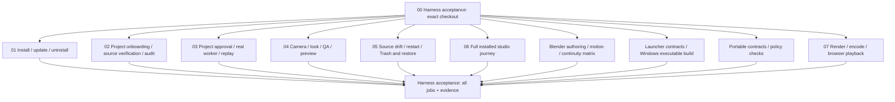

# CI map: follow a project from installation to recovery

Start with **00 · Harness acceptance** in Actions. It calls named, reusable
workflows for complete journeys at the **same source commit**. The final
**Harness acceptance** job is the aggregate check to select in repository rules
after its first successful run. This change does not alter repository protections.

The numbered workflows are independently runnable modules, not successive jobs
sharing an accidentally persistent runner. Each installed-studio journey creates
its own disposable studio and executes its prerequisites. The full journey then
checks those stages together in one studio. Reusable child workflows do not also
have push triggers: a push starts the coordinator, not duplicate independent
copies of every module. Push and PR runs have distinct concurrency groups.

## Read the Actions graph as the system map



| Workflow file and display name | Actual entry point and observable result |
|---|---|
| `e2e-installation.yml` — **01 · Installation lifecycle E2E** | Real shell bootstrap installs an archive of this checkout; repeats installation, updates a generated managed installation, runs the installed CLI, preserves host configuration, and uninstalls without deleting the catalog. Linux, macOS, Windows PowerShell and PowerShell Core. |
| `e2e-project-onboarding.yml` — **02 · Project onboarding and audit E2E** | Real browser creates a project, saves a brief, scans and attaches generated sources, verifies hashes and selects a saved working scene; the launcher invokes the installed harness and an actual Blender audit. |
| `e2e-project-execution.yml` — **03 · Approval and job execution E2E** | A native prepared job is bound to its project. Foreign binding is refused; MCP cancellation leaves the job planned; synthetic confirmation allows an actual CPU render. Output hashes and repeated-job reuse are verified. |
| `e2e-production.yml` — **04 · Scene authoring and preview E2E** | Installed CLI preparation → project binding → real project MCP adapter → actual Blender camera, lighting, world and look jobs → camera QA → CPU preview. A separate Blender process reopens the saved result to verify the camera move, authored values, preserved subject and restored production settings. |
| `e2e-project-recovery.yml` — **05 · Source integrity and recovery E2E** | After a real render, change only the generated source and require refusal; restore its original bytes, restart the server, reject the old token, verify persisted jobs, and Trash/restore the project through the browser. |
| `studio-e2e.yml` — **06 · Full installed studio E2E** | Run onboarding, execution, production and recovery together in the same fresh installed studio. Also supplies shared setup/execution to the focused journey workflows. All five studio scenarios run on Linux and Windows with Blender 5.2.1. |
| `e2e-showcase.yml` — **07 · Render and browser playback E2E** | Generate the existing real synthetic sequence, render four evaluated methods, encode and assemble the site, then verify approved media and technical playback in Chrome. Publishing is separate. |

A module's number is a navigation aid, not an artificial dependency. Independent
journeys run in parallel; shared prerequisites are exercised inside the journey,
not replaced with a previously fabricated successful state.

## What runs inside a studio

```text
generated source + disposable studio directories
    → actual installed Python harness and SQLite catalog
    → actual Node launcher and browser UI
    → native job preparation and project binding
    → real project MCP adapter, driven by a synthetic protocol client
    → actual isolated Blender worker and CPU render
    → persisted job/output hashes, restart and project recovery
```

The temporary root reproduces `Archive`, `Database`, `Docs`, `SystemRuntime` and
`Workspace`, including spaces in paths. It does not mount an E: drive or copy
personal assets. Installation, catalog and source checks are real. No alternate
mock application or mock Blender worker is used. Source-use confirmations and
scene-copy orchestration are explicitly synthetic; this is not an autonomous
model evaluation. See [the installed studio contract](STUDIO_E2E.md).

## Supporting checks are not mislabeled E2E

`checks-portable.yml` runs the ordinary contracts, policy tests and installer
self-test on the existing three OS/Python combinations. `launcher.yml` retains
Node contract tests and the real Windows executable build, but does not claim to
test tray/focus behavior. These execute on every coordinated revision instead of
being hidden behind a launcher-only path filter.

`blender-regressions.yml` retains the original 20 fixtures and adds isolated asset
preview coverage, for **21 fixture invocations** across
Blender **4.5.3, 5.0.0 and 5.2.1**. They are separated into three real-Blender
subsystems: **authoring** (9), **motion** (7), and **continuity** (5). This includes
normal and custom-role transfer, proxy skin, source/action identity, grounding and
full-take sequencing. These are deeper integration/regression checks, not proof
that the browser/installed-app route exercises every motion operation. Within a
subsystem, a failed fixture does not prevent the remaining fixtures from running;
the subsystem still fails. Missing JSON reports or required stdout markers fail.

`live-provider-acceptance.yml` runs real free-provider acquisition and retargeting
as **External · Live provider acquisition E2E**. An outage now produces a visible
failure in that separate workflow; it is not converted to success with
`continue-on-error`. It remains outside deterministic synthetic acceptance. The
five **Published installer defaults** HTTPS jobs remain separate and unchanged:
they validate published version selection, not installation of this branch.

## The acceptance contract

`tools/ci/contracts.py` inventories **23 required evidence partitions**:
10 installed-studio scenario/OS pairs, 4 installation shell/OS pairs, and 9
Blender subsystem/version pairs. The launcher, portable and showcase workflows
are additionally required through their dependency results; showcase retains its
existing render, media and browser evidence.

The final job runs with `if: always()`. It refuses any failed, cancelled, skipped
or absent module, any missing/duplicate/unknown evidence partition, a different
commit, incomplete or reordered checkpoints, or changed/missing required
attachments. It downloads only artifacts from its own run. Green setup jobs,
zero selected tests, or the mere existence of `report.json` are not acceptance.
The verifier does not certify a compromised runner or maliciously rewritten tests;
code review and repository controls remain necessary.

Each journey starts with a FAIL report and writes incremental checkpoints plus
JUnit. PASS is written only after required checks, cleanup and evidence capture
complete. Reports include exact commit, OS, scenario/version, limitations and
attachment SHA256s. Required uploads use `if-no-files-found: error`; failure logs
are retained where setup progressed far enough to produce them. Unexpected
setup failures remain failures, even when no browser or Blender report exists.

Artifacts retain bounded generated reports, logs and preview images for 14 days.
They exclude studio configuration, credentials, browser storage, personal assets,
SQLite catalogs and `.blend`/FBX files. Session tokens are redacted from textual
failure evidence. Do not upload the entire temporary studio to debug a failure.

## Triggers, publishing and maintenance

The coordinator runs on branch pushes, pull requests, merge groups, manual
invocation and reusable calls (including the existing release workflow). Local
`uses: ./.github/workflows/...` references bind child definitions to the caller's
commit. Child modules support `workflow_call` and `workflow_dispatch`; new manual
workflows must be available on the default branch before GitHub exposes their
manual dispatch entry points. Development-branch pushes still execute the new
modules through the coordinator without a merge or a PR.

**Transition Lab · Build and publish** invokes the same showcase validation and
publishes only main; **07** alone never deploys. The source-package and explicit
release workflows keep their existing responsibilities. Main deployment performs
its own same-run validation rather than trusting artifacts from another run.
This deliberately duplicates showcase work on main; feature/PR validation does
not also run the publishing workflow.

The old branch-cleanup dry run is now an explicitly named, manual maintenance
workflow. Automatic main cleanup retains its inventory, expected-tip leases,
ancestry checks and other safeguards. Only its required CI workflow name changes
to **00 · Harness acceptance**. No historical branch tips are edited. Diagnostics,
cleanup, packaging and publishing are operational workflows, not E2E test claims.

## Review findings and remaining coverage

Before this change, the large CI workflow mixed portable tests, installation,
Blender regression fixtures, cleanup and informational network checks. The useful
installed-studio journey was a single long script, and look-development report
copies could be silently ignored. The new structure separates responsibilities,
requires measured checkpoints and reports, adds replay/token-rotation checks, and
adds the installed camera/look/preview chain instead of just renaming jobs.

A public synthetic pass does **not** establish authenticated Codex/model behavior,
native desktop focus/tray behavior, live Blender add-on MCP connectivity, private
licensed-input acceptance, or artistic/temporal quality. The installed-studio
journeys still do not exercise retargeting through the app; real motion fixtures
cover it separately. Private integration must still pin the exact public commit
and retain private evidence before the documented acceptance/release decision.
No model calls, paid services, local AI inference, release, production install or
repository-settings change is introduced here.

## Reproduce and diagnose

Blender setup now streams downloader errors to the job log instead of hiding
stderr inside a failed subprocess. Checksum fetches have a 40-second wall-clock
deadline per official source. Archive transport tries the existing official
mirror and publisher, at most twice each, with 150 seconds per attempt and two
seconds of backoff in the second round. A separate owned download process makes
the deadline apply to slow trickle transfers as well as stalled sockets.

Every archive attempt uses the same verified-manifest SHA256. Checksum mismatch,
invalid/ambiguous manifest, TLS verification failure, insecure redirect, excessive
size, and non-transient HTTP errors remain terminal failures. Interrupted attempts
are retained in the disposable runner directory, never appended to or treated as
verified archives. Setup requires an empty destination. No checksum, fixture,
required evidence partition, native test or job deadline is relaxed. A retry
passing is not a retroactive pass for the failed attempt.

```sh
python tools/run_checks.py --offline
python tools/ci/run_bootstrap.py --shell sh --evidence /temporary/install-evidence
python tools/studio_e2e/run.py --blender /absolute/path/to/blender \
  --scenario full --evidence /temporary/studio-evidence
python tools/ci/run_blender_suite.py --suite motion --blender /absolute/path/to/blender \
  --version 5.2.1 --evidence /temporary/motion-evidence
```

Use `onboarding`, `execution`, `production` or `recovery` to reproduce a focused
studio journey. Python 3.11+, Node, Blender and the pinned Playwright/browser
runtime are prerequisites; the runner does not install substitutes into a user's
studio. All reports identify untested boundaries. A local portable pass, queued
Actions run or a historical report is never a claim that current E2E passed.

## Shot-aware workbench acceptance

The production/full studio journeys now require `workbench_shot_roundtrip` as a
separate checkpoint in each OS partition. The browser saves a named shot from an
observed camera, requests an actual camera-bound preview and render, plays and
approves the generated movie, then revises the shot without changing scene bytes.
It requires HTTP 409 from approval of the old cut, preserves its historical movie,
and removes stale inputs. `workbench-shot-revision.png` is a required hashed
attachment, not optional decoration.

The real Blender authoring fixture also renders two cameras at the same frame in
a scene with a conflicting camera marker. It compares generated image hashes and
reopens saved preview artifacts to check marker preservation. The original scene
hash must remain unchanged. This proves the isolated worker contract, not live
GUI task ownership, authenticated agent decisions or artistic quality.
